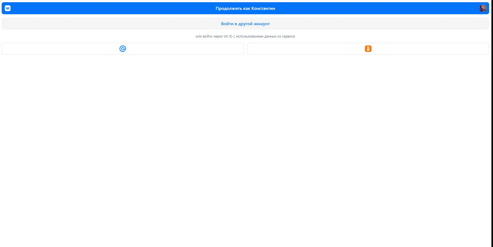
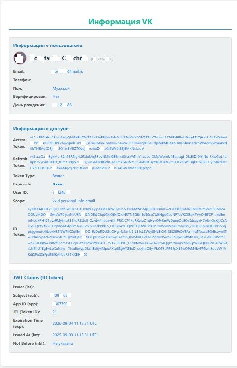

# Интеграция OAuth VK ID с использованием Golang

[](https://golang.org/)
[](https://opensource.org/licenses/MIT)
[](https://github.com/yourusername/yourrepository#tags)

---

## 🚀 О проекте

Это учебный проект, демонстрирующий интеграцию **OAuth VK ID** с серверным кодом, написанным на **Golang**.

**VK ID** предоставляет удобный и безопасный способ авторизации пользователей на вашем сайте или в мобильном приложении. Он позволяет пользователям входить с использованием своих учетных записей:
*   ВКонтакте
*   Одноклассники (ОК)
*   Mail.ru

VK ID также обеспечивает безопасную работу с данными пользователя с его явного согласия.

---

## 📚 Использованные технологии и подходы

*   **Язык:** Golang (рекомендуется версия >= 1.20)
*   **OAuth 2.0:** Реализация протокола OAuth 2.0 для взаимодействия с VK ID.
*   **VK ID API:** Основано на официальной документации: [https://id.vk.com/about/business/go/docs/ru/vkid/latest/vk-id/api-description](https://id.vk.com/about/business/go/docs/ru/vkid/latest/vk-id/api-description)
*   **Библиотеки:**
    *   Используются как **нативные методы API VK ID**, так и популярная библиотека `golang.org/x/oauth2`.
*   **JWT (JSON Web Tokens):** Приведен пример обработки и сериализации `id_token`, выдаваемого после успешной авторизации вместе с `Access` и `Refresh` токенами.
*   **Конфигурация:** Используется библиотека **Viper** для управления конфигурацией приложения из файла `config.yaml`.

---

## 🖼️ Демонстрация

**(Здесь вы можете вставить ссылки или встроить изображения)**

*   
*   

---

## ⚙️ Установка и запуск

### Предварительные требования:
*   Установленный Go (рекомендуется версия >= 1.20)
*   Учетная запись разработчика VK для получения Client ID и Client Secret

### Получение Client ID и Client Secret:
1.  Перейдите на [https://dev.vk.com/](https://dev.vk.com/)
2.  Создайте новое приложение или используйте существующее.
3.  В настройках приложения найдите **Client ID** (идентификатор приложения) и **Client Secret** (секретный ключ приложения).
4.  Настройте **Redirect URI** (URI перенаправления) в вашем приложении VK ID на тот, который используется в вашем Go-приложении (например, `http://localhost:8080/callback` для локальной разработки).

### Клонирование репозитория:
```bash
git clone https://github.com/Hoher2000/vk_auth_API_golang.git
cd vk_auth_API_golang
make